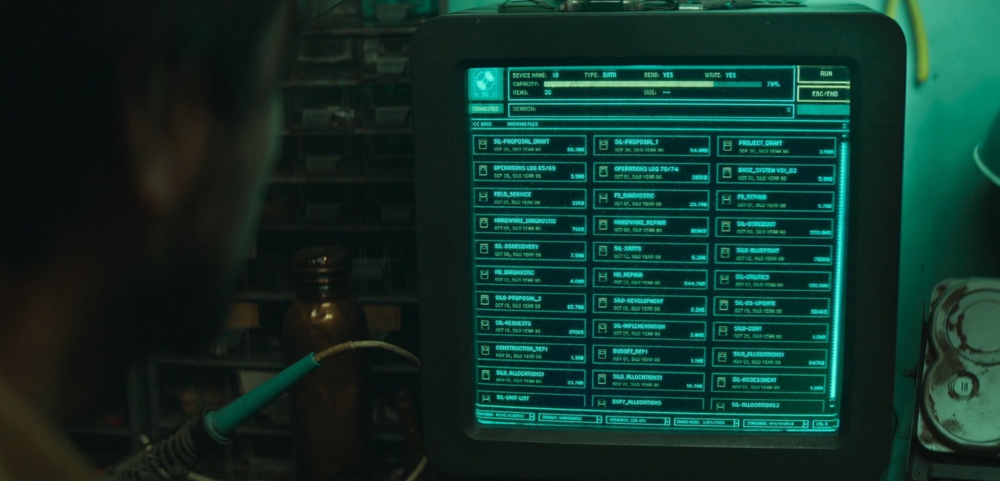

# CDX (Change Directory Xplorer)

A modern, terminal-based file explorer with vim-like navigation and visual grid layout. Inspired by "Silo" the AppleTv Series


https://github.com/user-attachments/assets/e41af138-e348-41ec-b672-dbec5b3de594


## Inspiration

I may have been one of the few people that really vibes with the Silo computers. It truly is retro-futuristic looking!



## Features

- Terminal-based UI with clean, visual grid layout
- Vim-style navigation (h/j/k/l keys)
- File metadata display (size, modification date)
- Path breadcrumb navigation
- Open files with system default applications
- Cross-platform support (macOS, Linux, Windows)

## Installation

> **Note:** CDX has been primarily tested on macOS but should work on Linux and Windows. The Windows installation script has been AI-generated and has not been tested.

### Automatic Installation

#### macOS/Linux:
```bash
curl -fsSL https://raw.githubusercontent.com/rodpadev/cdx/main/install.sh | bash
```

#### Windows:
```powershell
iwr -useb https://raw.githubusercontent.com/rodpadev/cdx/main/install.ps1 | iex
```

The installer will:
- Create `~/.cdx` directory (or `%USERPROFILE%\.cdx` on Windows)
- Download the source code
- Build the application
- Add the binary to your PATH

### Manual Installation

1. Ensure Go is installed on your system
2. Clone the repository:
   ```bash
   git clone https://github.com/rodpadev/cdx.git
   cd cdx
   ```
3. Build the application:
   ```bash
   go build -o cdx
   ```
4. Move the binary to a location in your PATH:
   ```bash
   mv cdx /usr/local/bin/
   ```

## Usage

Start CDX in the current directory:
```bash
cdx
```

### Navigation

- `h` - Move left
- `j` - Move down
- `k` - Move up
- `l` - Move right
- `Enter` - Open file/directory
- `Backspace` - Go up one directory
- `q` - Quit application

## Requirements

- Go 1.16 or higher
- Terminal with support for TUI applications
